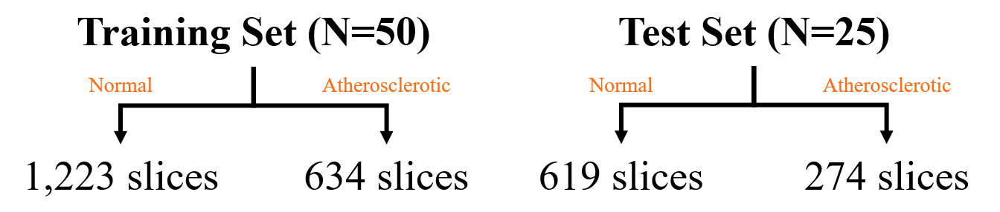
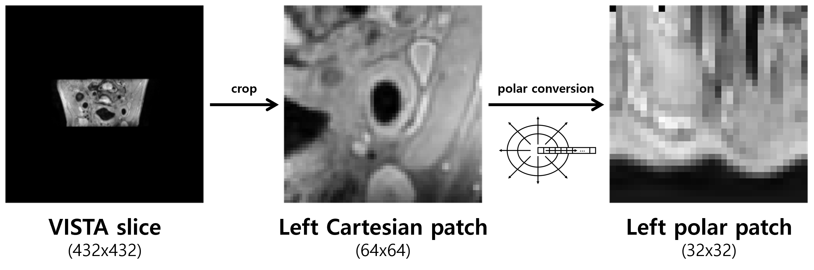
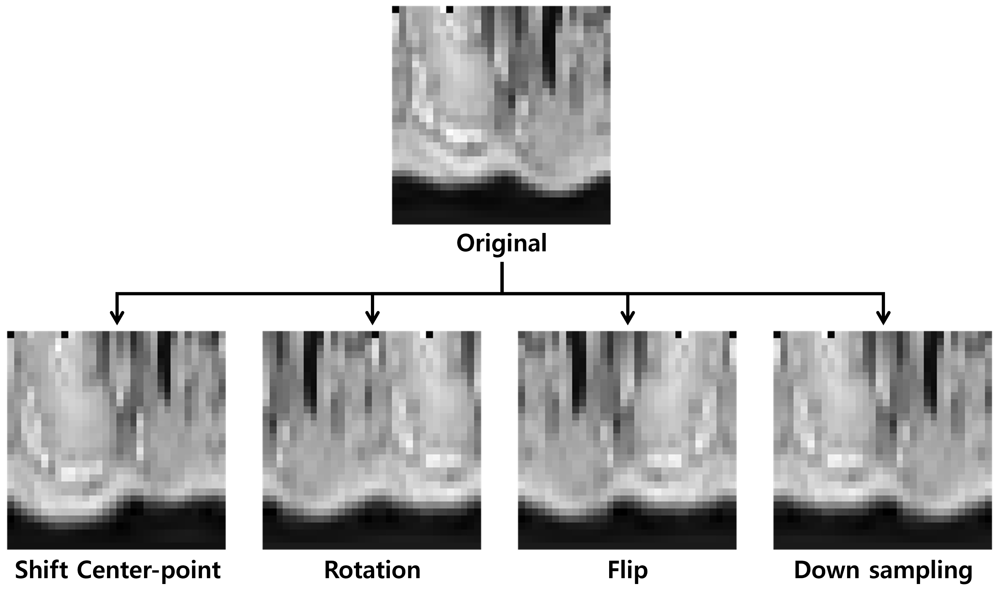
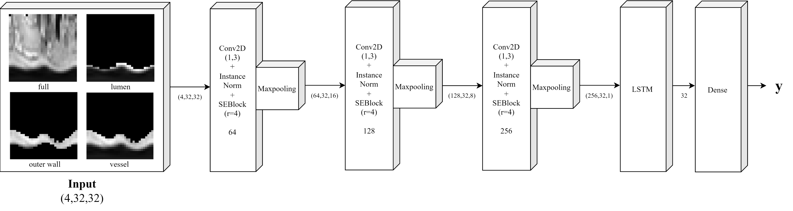

# SE-LSTMNet
SE-LSTMNet Model Using Polar Conversion for Diagnosis of Atherosclerosis

 

## 1. Introduction
Atherosclerosis is a chronic vascular inflammatory disease in which plaque builds up in the arteries and impairs blood flow.
This can lead to heart disease and stroke.
Since most people do not have any symptoms until the artery is severely narrowed, early detection of atherosclerosis is critical.

## 2. Materials & Methods
### **Dataset**
MICCAI 2022 CarOtid vessel wall SegMentation and Atherosclerosis diagnosis challenge (COSMOS)

 

 

### **Polar Conversion**
applied to each VISTA slice based on the vessel center

 

 

### **Data Augmentation**
1. Shift Center-point [(0,0),(2,0),(-1,0),(0,2),(0,-1)]
2. Polar patch Rotation & Flip
3. Low Resolution (2x down-sample followed by 2x up-sample 

 

 

### **SE-LSTMNet**

 

 

## 3. Results
In this paper, in order to effectively detect atherosclerotic lesions in tube-shaped blood vessels, polar conversion is applied to MRI images based on the vessel center.

We then propose a SE-LSTMNet model using continuous signal information for each angle of a polar coordinate image.

| |Accuracy|Sensitivity|Specificity|F1 Score|AUC|
|:---:|:---:|:---:|:---:|:---:|:---:|
|fold1|0.8813|0.8675|**0.9124**|0.8251|0.9619|
|fold2|0.8853|0.8869|0.8832|0.8259|0.9608|
|fold3|0.9104|0.9338|0.8577|0.8545|0.9668|
|fold4|0.9048|0.9128|0.8869|0.8511|0.9067|
|fold5|0.9149|**0.9386**|0.8613|0.8613|0.9649|
|ensemble|**0.9194**|0.9370|0.8796|**0.8700**|**0.9719**|
|radiomics|0.8791|0.8998|0.8321|0.8085|0.9339|